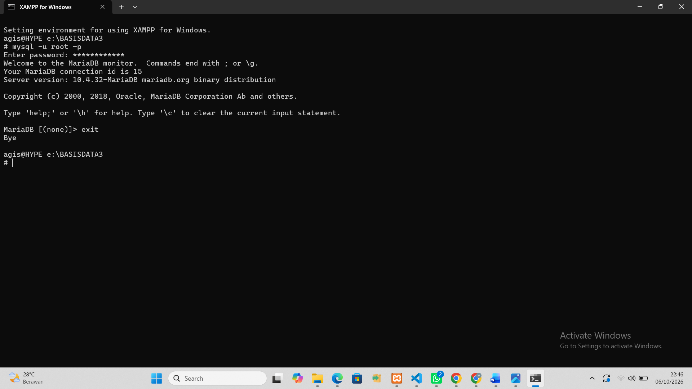
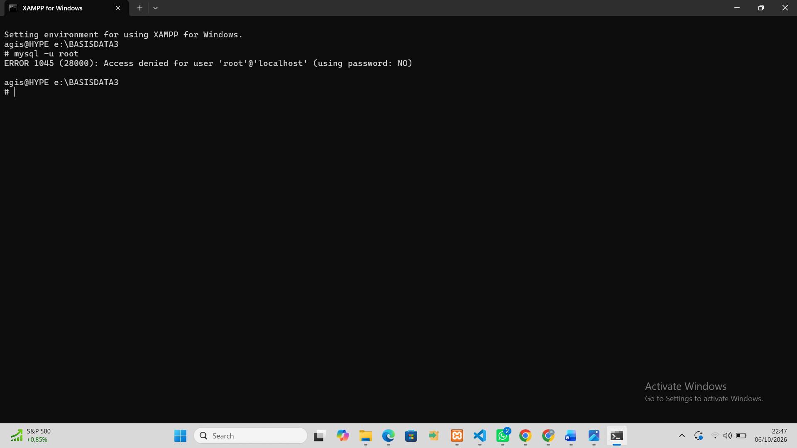
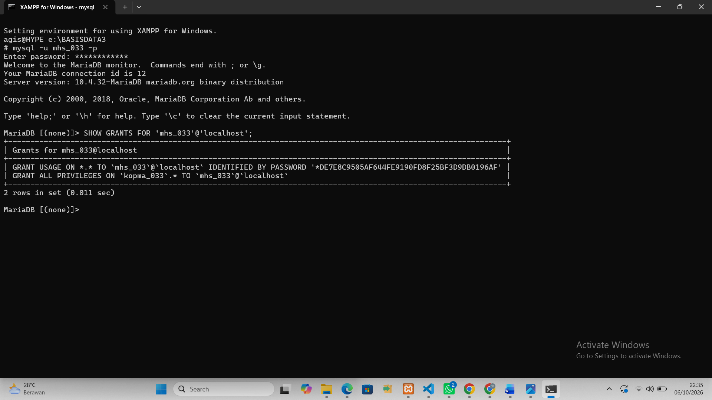
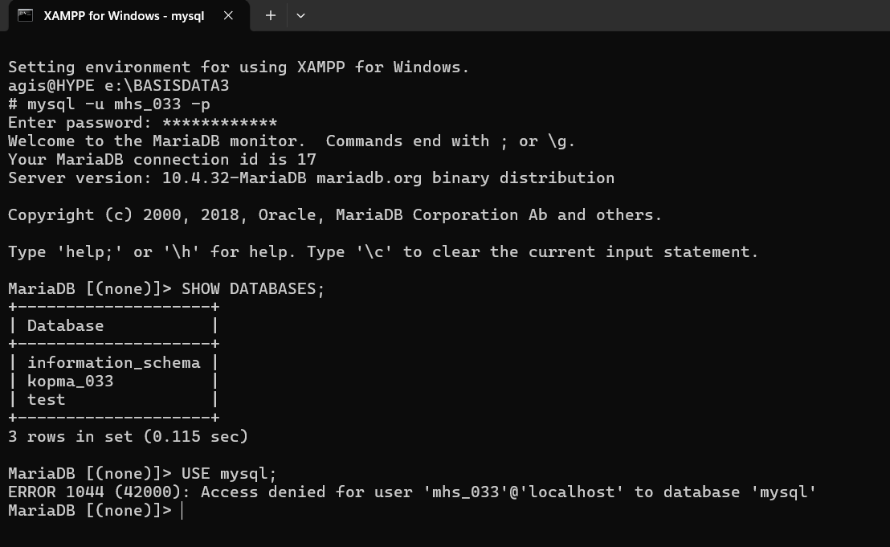
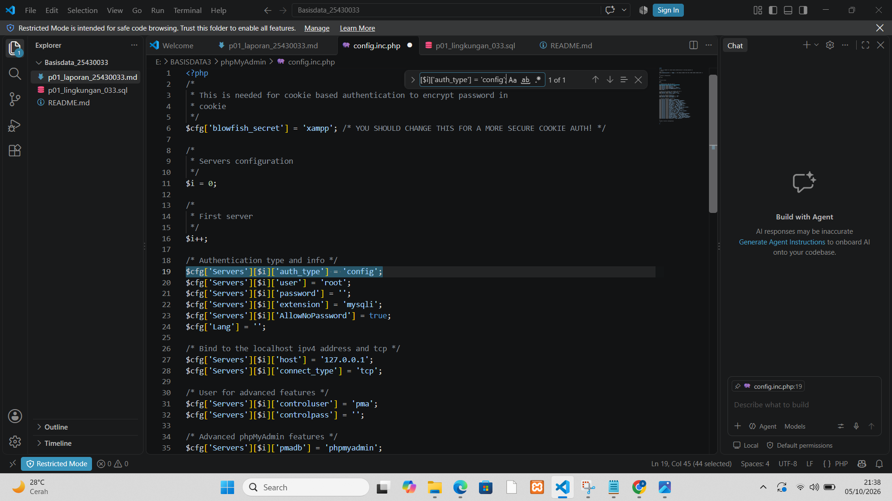
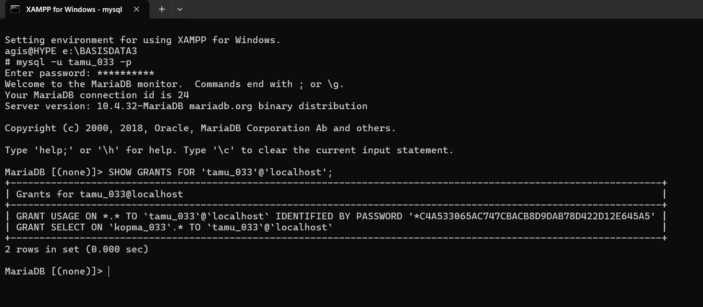
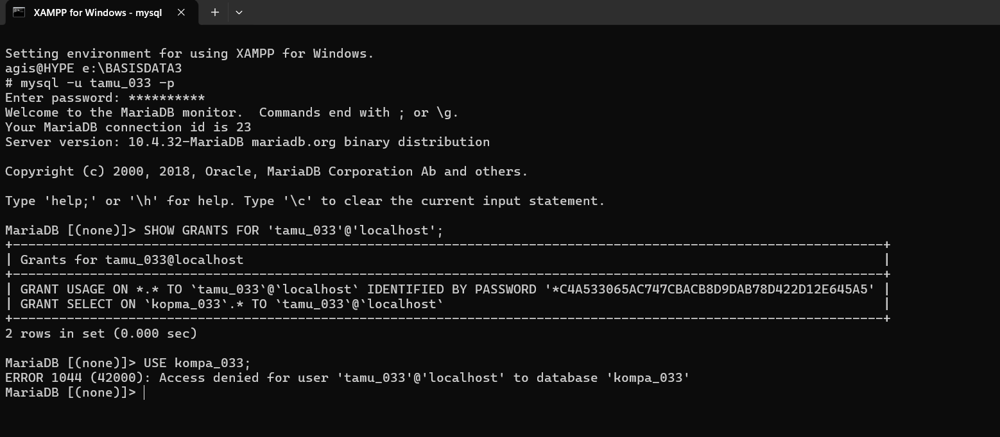
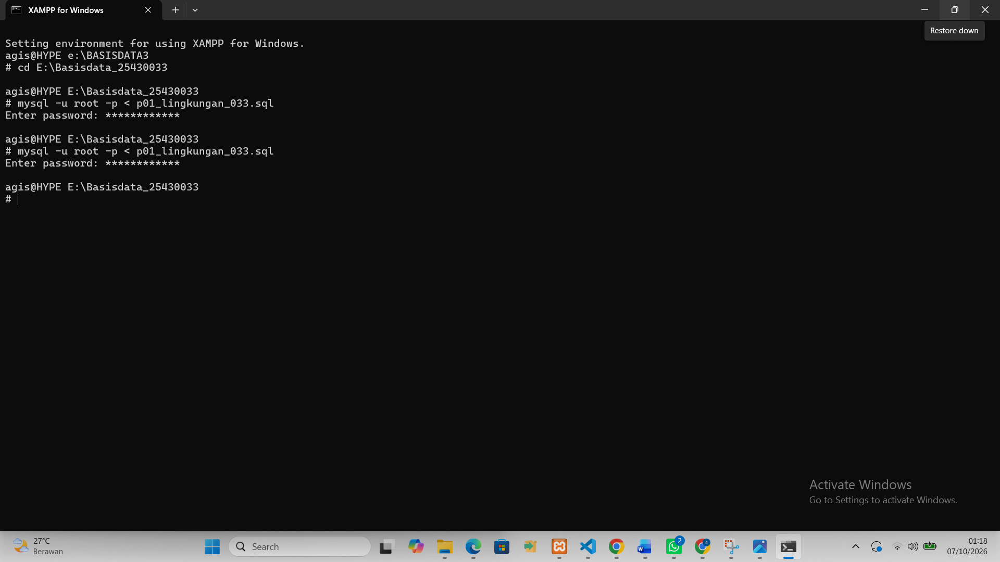

# Laporan Praktikum Basis Data - Pertemuan 01

**Nama:** **Agis Sapitri**   
**NIM:** **25430033**  
**Kelas:** **B**    
**Tanggal:** **04 oktober 2026**

## 1. Tujuan Praktikum

Pada pertemuan pertama ini saya ingin memastikan komputer saya siap dipakai belajar basis data. Saya menyalakan MariaDB lewat XAMPP, lalu mencoba masuk ke server dengan CLI dan phpMyAdmin, memberi password pada root, dan membuat basis data kopma_033 serta basis data proyek perpus_033 berenkoding utf8mb4. Dari situ saya juga belajar membaca kode galat 1044, 1045, dan 1142 supaya tahu penyebab sebuah penolakan.

Saya juga melatih cara kerja yang aman. Akun mhs_033 dan dev_033 saya buat hanya punya hak pada basis datanya masing-masing, lalu saya uji dengan mencoba membuka basis data yang bukan haknya. Di akhir, saya mencatat semua pekerjaan dengan Git dan mengirimnya ke GitHub, dengan .gitignore agar berkas berisi password tidak ikut terunggah.

## 2. Ringkasan Dasar Teori

MariaDB bekerja dengan cara klien-server. Server (`mysqld`) jalan di latar belakang lewat port 3306, sedangkan `mysql` di CLI dan phpMyAdmin adalah klien yang mengirim perintah. Kalau pesannya "tidak bisa terhubung", masalahnya di koneksi atau server belum nyala. Kalau ada kode ERROR, berarti koneksi berhasil dan server yang menolak.

Akun di MariaDB dibedakan dari pasangan nama dan host, jadi `root@localhost` dan `root@127.0.0.1` itu dua akun berbeda. Prinsip yang dipakai adalah hak akses minimum: root hanya untuk administrasi, pekerjaan sehari-hari pakai akun yang hanya punya hak di satu basis data. Git dipakai untuk mencatat perubahan lewat commit dan sebagai bukti kerja bertahap.

Ada dua cara berbicara dengan server. CLI memakai perintah yang diketik sehingga bisa disimpan sebagai skrip dan diulang persis sama. phpMyAdmin berbasis tampilan web yang enak untuk melihat isi tabel, tetapi langkahnya sulit dicatat ulang. Karena itu CLI jadi alat utama dan phpMyAdmin hanya pendamping.

## 3. Hasil Langkah Percobaan

Alat yang saya pakai: Windows 11, XAMPP 8.2.12 (MariaDB 10.4.32 dan phpMyAdmin 5.2.1), Git for Windows, akun GitHub, dan Visual Studio Code.

### 3.1 Menjalankan Shell XAMPP dan Login MariaDB 


*Gambar 3.1 XAMPP Control Panel dengan modul MySQL berjalan di port 3306*

### 3.2 Masuk lewat CLI sebagai root
```sql
mysql -u root
SELECT VERSION(), CURRENT_USER();
SHOW DATABASES;
SELECT @@sql_mode;
```


*Gambar 3.2 Hasil login MariaDB sebagai root.*

### 3.3 Mengamankan root
Pertama saya cek akun root yang ada, lalu memberi password pada ketiganya (localhost, 127.0.0.1, dan ::1), kemudian masuk lagi memakai `-p`.

```sql
SELECT User, Host FROM mysql.user WHERE User = 'root';
ALTER USER 'root'@'localhost' IDENTIFIED BY '<password_root>';
ALTER USER 'root'@'127.0.0.1' IDENTIFIED BY '<password_root>';
ALTER USER 'root'@'::1'       IDENTIFIED BY '<password_root>';
```
```text
mysql -u root -p
```


*Gambar 3.3 Hasil login root dengan opsi -p*

Setelah itu saya sengaja masuk tanpa `-p`:


*Gambar 3.3 Hasil login root tanpa opsi -p*
<terjasi error saat saya memasukan root tanpa -p.>

### 3.4 Basis data dan akun kerja
```sql
CREATE DATABASE kopma_123 
    CHARACTER SET utf8mb4 COLLATE utf8mb4_unicode_ci;
CREATE USER 'mhs_123'@'localhost' IDENTIFIED BY '<password_kerja>';
GRANT ALL PRIVILEGES ON kopma_123.* TO 'mhs_123'@'localhost';
SHOW GRANTS FOR 'mhs_123'@'localhost';
```


Lalu masuk dengan `mysql -u mhs_123 -p`, jalankan `SHOW DATABASES;` dan `USE mysql;`.


### 3.4 Menggunakan phpMyAdmin dengan Aman

Apache dijalankan, masuk pada `config.inc.php` lalu pada `$cfg['Servers'][$i]['auth_type'] = 'confic';` diubah bagian `'config'` menjadi `'cookie'` agar phpMyAdmin meminta login.




## 4. Jawaban Titik Analisis

**Titik Analisis 1.** 
Tombolnya bertuliskan MySQL tapi yang jalan MariaDB. MariaDB itu turunan MySQL, jadi banyak perintah dan kode galatnya sama. Waktu mencari solusi di internet, jawaban untuk MySQL sering masih bisa dipakai, terutama untuk SQL dasar seperti SELECT dan GRANT. Tapi untuk hal yang beda antarversi, misalnya nilai bawaan `sql_mode` atau cara autentikasi, sebaiknya lihat dokumentasi MariaDB supaya tidak salah.

**Titik Analisis 2.** 
Galat yang muncul: `<tempel pesan galat Anda>`. Bagian yang menunjukkan password tidak dikirim adalah `using password: NO`. Kalau passwordnya dikirim tapi salah, tulisannya `using password: YES`.

**Titik Analisis 3.** 
`information_schema` tetap terlihat karena itu basis data khusus yang berisi informasi (metadata) dan bisa dilihat semua akun, tapi hanya untuk objek yang memang boleh diakses akun itu. Basis data `mysql` menyimpan data akun dan hak akses, dan `mhs_033` hanya diberi hak di `kopma_033`, jadi ditolak dengan ERROR 1044. Bedanya, 1044 muncul ketika sudah berhasil masuk tapi tidak berhak ke basis data tertentu, sedangkan 1045 muncul ketika proses masuknya sendiri gagal (password salah atau tidak dikirim).

**Titik Analisis 4.** 
Di mode `config`, password disimpan di file konfigurasi dan phpMyAdmin langsung masuk otomatis, sehingga siapa saja yang membuka halamannya bisa masuk. Di mode `cookie`, kita harus mengetik username dan password tiap masuk, dan password tidak tersimpan di file.

## 5. Hasil Latihan dan Modifikasi

### Latihan 1: Akun tamu dengan hak SELECT saja

Akun `tamu_<3d>` dibuat sebagai root dan hanya diberi hak `SELECT` pada `kopma_<3d>`.

```sql
CREATE USER 'tamu_<3d>'@'localhost' IDENTIFIED BY '<password_tamu>';
GRANT SELECT ON kopma_<3d>.* TO 'tamu_<3d>'@'localhost';
SHOW GRANTS FOR 'tamu_<3d>'@'localhost';
```



Kemudian masuk sebagai `tamu_033`, memilih basis data, dan mencoba membuat tabel.

```sql
mysql -u tamu_<3d> -p
USE kopma_<3d>;
CREATE TABLE uji (id INT);
```

*Hasil*


**Latihan 2 (skrip bisa diulang).** Saya memakai `IF NOT EXISTS` pada `CREATE DATABASE` dan `CREATE USER`, lalu menjalankan skrip dua kali.



<skrip dijalankan dua kali tampa error.>

## 6. Tugas Mandiri: Milestone Proyek 01

* * Deskripsi Milestone:*
* Target pada milestone ini adalah menyiapkan lingkungan kerja awal untuk proyek pribadi berbasis dua digit terakhir NIM (NIM: 25430033, Tema: Sistem Informasi Manajemen Perpustakaan Digital / Online, Kode Tema: perpustakaan). Membuat basis data proyek Sistem Informasi Manajemen Perpustakaan Digital / Online dengan konfigurasi character set utf8mb4. Membuat akun pengguna kerja dev_033 dengan hak akses terbatas, khusus untuk database perpustakaan_018. Mengisi identitas proyek pada berkas README.md, yaitu organisasi fiktif "Perpustakaan Parable", tema, dan cakupan layanan. Menambahkan berkas .gitignore untuk mencegah terunggahnya kredensial sensitif. Melakukan pengiriman awal ke repositori GitHub basisdata_25430033.

## 7. Pembahasan dan Kendala

* Pembahasan: Pada praktikum ini, perintah DDL berhasil membentuk struktur basis data perpustakaan dan lingkungan proyek sistem pustaka. Penentuan tipe data seperti INT untuk ID atau jumlah stok buku, VARCHAR untuk teks dinamis seperti judul dan nama anggota, serta DATE untuk tanggal peminjaman sudah sesuai dengan aturan perancangan basis data relasional. Penerapan integrity constraint seperti PRIMARY KEY dan FOREIGN KEY menjaga konsistensi relasi antar-tabel. Pada konfigurasi pengguna, penerapannya sudah sesuai dengan prinsip keamanan least privilege. Akun dev_033 hanya mendapat hak akses pada database perpus_033 untuk mencegah pengaksesan atau modifikasi tidak sah pada database lain (seperti kopma_033).
* Kendala dan Solusi:
* Kendala 1: Saat menjalankan ulang skrip SQL pembuatan basis data dan pengguna, muncul eror galat karena objek perpus_033 dan akun dev_033 sudah terdaftar di sistem.
Solusi: Menambahkan klausa IF NOT EXISTS pada perintah CREATE DATABASE dan CREATE USER agar skrip dapat dijalankan berulang kali tanpa timbul galat.
* Kendala 2: Kendala 2: Akun dev_033 sempat tidak bisa mengakses atau hak aksesnya belum aktif secara langsung setelah dibuat lewat skrip.
Solusi: Menambahkan perintah FLUSH PRIVILEGES; di akhir skrip SQL agar MariaDB langsung memperbarui tabel hak akses sistem secara penuh.

## 8. Kesimpulan

Praktikum Modul 1 berhasil mengenalkan lingkungan kerja MariaDB/MySQL melalui terminal CLI maupun GUI phpMyAdmin, serta penggunaan perintah Data Definition Language (DDL) untuk mengelola struktur database dan tabel perpustakaan. Pemilihan tipe data yang presisi dan penerapan constraint (PRIMARY KEY, FOREIGN KEY, NOT NULL, UNIQUE) sangat penting untuk menjaga integritas, keamanan, dan keabsahan relasi data perpustakaan. Penerapan hak akses akun kerja berbasis least privilege pada akun dev_033 serta integrasi Git/GitHub (.gitignore dan README.md) mendukung pengelolaan proyek basis data yang terstruktur, aman, dan dapat dilacak dengan baik.

## 9. Pernyataan Penggunaan AI

Dengan ini saya menyatakan bahwa saya menggunakan* bantuan Artificial Intelligence (sebagai alat bantu pemahaman atau pengecekan kode), dengan tetap bertanggung jawab penuh atas seluruh isi, analisis, dan kode program yang dikumpulkan dalam laporan praktikum ini.

## 10. Bukti Git

* Link Repositori: [https://github.com/agissapitri409-cloud/basisdata_25430033]
* Tangkapan Layar Git Log / Commit:

