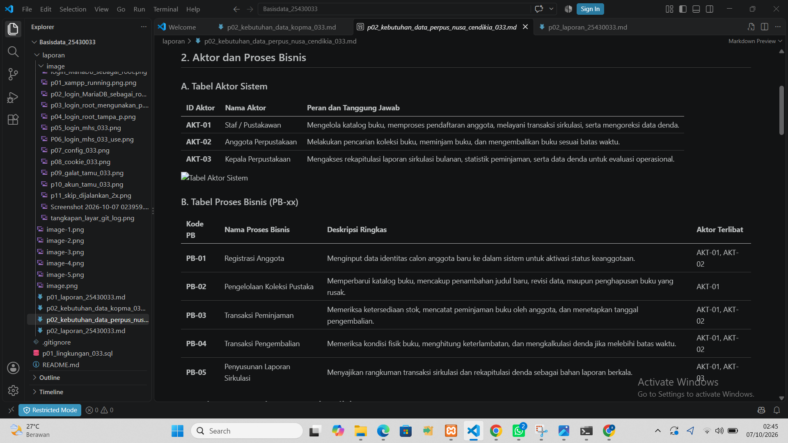

# Laporan Praktikum Basis Data - Pertemuan 2: Dokumen kebutuhan data

**Nama:** Agis Sapitri  
**NPM:** 25430033  
**Kelas:** B  
**Tanggal:** 7 Oktober 2026  
**Proyek Basis Data:** Perpustakaan Nusa Cendekia (`perpus_nusa_cendekia_033` / `perpus_033`)  

## 1. Latar Belakang dan Aktivitas Organisasi
Perpustakaan Nusa Cendekia merupakan pusat sumber belajar dan literasi akademis yang melayani pengelolaan pustaka, keanggotaan, serta peminjaman dan pengembalian koleksi buku. Meningkatnya jumlah anggota serta volume transaksi harian membuat pengelolaan berbasis pencatatan manual kurang efektif. Kendala yang kerap muncul meliputi duplikasi data, ketidaksesuaian laporan denda, hingga risiko kehilangan rekam jejak transaksi peminjaman. 

Untuk mengatasi permasalahan tersebut, dirancang sistem basis data relasional **`perpus_nusa_cendekia_033`** (disingkat `perpus_033`). Sistem ini bertujuan menyediakan media penyimpanan yang terstruktur, aman, serta mampu mendukung otomatisasi operasional di Perpustakaan Nusa Cendekia secara efisien.

## 2. Aktor dan Proses Bisnis

### A. Tabel Aktor Sistem
| ID Aktor | Nama Aktor | Peran dan Tanggung Jawab |
| :--- | :--- | :--- |
| **AKT-01** | Staf / Pustakawan | Mengelola katalog buku, memproses pendaftaran anggota, melayani transaksi sirkulasi, serta mengoreksi data denda. |
| **AKT-02** | Anggota Perpustakaan | Melakukan pencarian koleksi buku, meminjam buku, dan mengembalikan buku sesuai batas waktu. |
| **AKT-03** | Kepala Perpustakaan | Mengakses rekapitulasi laporan sirkulasi bulanan, statistik peminjaman, serta data denda untuk evaluasi operasional. |

### B. Tabel Proses Bisnis (PB-xx)
| Kode PB | Nama Proses Bisnis | Deskripsi Ringkas | Aktor Terlibat |
| :--- | :--- | :--- | :--- |
| **PB-01** | Registrasi Anggota | Menginput data identitas calon anggota baru ke dalam sistem untuk aktivasi status keanggotaan. | AKT-01, AKT-02 |
| **PB-02** | Pengelolaan Koleksi Pustaka | Memperbarui katalog buku, mencakup penambahan judul baru, revisi data, maupun penghapusan buku yang rusak. | AKT-01 |
| **PB-03** | Transaksi Peminjaman | Memeriksa ketersediaan stok, mencatat peminjaman buku oleh anggota, dan menetapkan tanggal pengembalian. | AKT-01, AKT-02 |
| **PB-04** | Transaksi Pengembalian | Memeriksa kondisi fisik buku, menghitung keterlambatan, dan mengkalkulasi denda jika melebihi batas waktu. | AKT-01, AKT-02 |
| **PB-05** | Penyusunan Laporan Sirkulasi | Menyajikan rangkuman transaksi sirkulasi dan rekapitulasi denda sebagai bahan laporan berkala. | AKT-01, AKT-03 |

## 3. Dokumen Sumber yang Dianalisis
1. **Formulir Pendaftaran Keanggotaan:** Lembar pendataan yang memuat informasi nama lengkap, nomor identitas (NPM/NIK), email, kontak, serta tanggal pendaftaran.
2. **Katalog Buku Induk:** Dokumen inventaris yang memuat nomor ISBN, judul buku, penulis, penerbit, tahun terbit, dan ketersediaan stok.
3. **Resi / Kartu Sirkulasi:** Bukti transaksi yang mencantumkan kode peminjaman, identitas peminjam, rincian buku yang dipinjam, tanggal pinjam, dan batas waktu pengembalian.
4. **Bukti Pembayaran Denda:** Catatan resmi terkait penyelesaian denda atas keterlambatan pengembalian buku.

## 4. Entitas Kandidat dan Elemen Data

1. **Anggota (`anggota`)**
   * Elemen Data: `id_anggota` (PK), `npm_nik`, `nama_lengkap`, `email`, `nomor_telepon`, `tanggal_daftar`.
2. **Kategori (`kategori`)**
   * Elemen Data: `id_kategori` (PK), `nama_kategori`.
3. **Buku (`buku`)**
   * Elemen Data: `id_buku` (PK), `isbn`, `judul`, `penulis`, `penerbit`, `tahun_terbit`, `stok`, `id_kategori` (FK).
4. **Peminjaman (`peminjaman`)**
   * Elemen Data: `id_peminjaman` (PK), `id_anggota` (FK), `tanggal_pinjam`, `tanggal_tenggat`, `status`.
5. **Detail Peminjaman (`detail_peminjaman`)**
   * Elemen Data: `id_detail` (PK), `id_peminjaman` (FK), `id_buku` (FK), `jumlah`.

## 5. Aturan Bisnis (Tabel AB-xx)

| Kode AB | Pernyataan Aturan Bisnis | Implikasi Pada Basis Data |
| :--- | :--- | :--- |
| **AB-01** | Setiap anggota wajib memiliki nomor identitas (NPM/NIK) dan email yang terdaftar secara unik. | Kolom `npm_nik` dan `email` diberikan constraint `UNIQUE` dan `NOT NULL`. |
| **AB-02** | Setiap entri buku wajib terhubung dengan satu kategori pustaka yang terdaftar. | Kolom `id_kategori` pada tabel `buku` diset sebagai *Foreign Key* ke tabel `kategori`. |
| **AB-03** | Satu transaksi peminjaman dapat mencakup lebih dari satu judul buku. | Dibuat tabel perantara *many-to-many* (`detail_peminjaman`) untuk menjembatani tabel `peminjaman` dan `buku`. |
| **AB-04** | Status transaksi peminjaman dibatasi pada pilihan: 'dipinjam', 'dikembalikan', atau 'terlambat'. | Kolom `status` menerapkan tipe data `ENUM('dipinjam', 'dikembalikan', 'terlambat')`. |
| **AB-05** | Jumlah stok buku tidak boleh bernilai negatif dan secara standar bernilai 0. | Kolom `stok` diatur dengan `INT NOT NULL DEFAULT 0` beserta pengecekan nilai minimum. |

## 6. Kebutuhan Informasi (Tabel KI-xx)

| Kode KI | Kebutuhan Informasi | Sumber Data (Tabel) |
| :--- | :--- | :--- |
| **KI-01** | Informasi data keanggotaan aktif beserta detail kontak lengkap. | `anggota` |
| **KI-02** | Pencarian ketersediaan stok buku berdasarkan judul atau kelompok kategori. | `buku`, `kategori` |
| **KI-03** | Rekap harian transaksi peminjaman yang masih aktif (*active loans*). | `peminjaman`, `anggota`, `detail_peminjaman`, `buku` |
| **KI-04** | Riwayat transaksi peminjaman dari setiap anggota dalam rentang waktu tertentu. | `anggota`, `peminjaman`, `detail_peminjaman` |

## 7. Matriks CRUD

| Entitas / Tabel | PB-01 (Registrasi) | PB-02 (Katalog) | PB-03 (Peminjaman) | PB-04 (Pengembalian) | PB-05 (Pelaporan) |
| :--- | :---: | :---: | :---: | :---: | :---: |
| **`anggota`** | **C, R, U** | - | **R** | **R** | **R** |
| **`kategori`** | - | **C, R, U, D** | **R** | - | **R** |
| **`buku`** | - | **C, R, U, D** | **R, U** | **R, U** | **R** |
| **`peminjaman`** | - | - | **C, R** | **R, U** | **R** |
| **`detail_peminjaman`** | - | - | **C, R** | **R** | **R** |

*(Keterangan: **C** = Create, **R** = Read, **U** = Update, **D** = Delete)*

## 8. Kamus Data Awal

| Nama Tabel | Nama Kolom | Tipe Data | Batasan / Constraint | Penanggung Jawab Data |
| :--- | :--- | :--- | :--- | :--- |
| **`anggota`** | `id_anggota` | INT | PRIMARY KEY, AUTO_INCREMENT | Petugas Administrasi |
| | `npm_nik` | VARCHAR(20) | NOT NULL, UNIQUE | Petugas Administrasi |
| | `nama_lengkap` | VARCHAR(100) | NOT NULL | Petugas Administrasi |
| | `email` | VARCHAR(100) | NOT NULL, UNIQUE | Petugas Administrasi |
| | `nomor_telepon` | VARCHAR(15) | NULL | Petugas Administrasi |
| | `tanggal_daftar` | DATE | DEFAULT CURRENT_DATE | Petugas Administrasi |
| **`kategori`** | `id_kategori` | INT | PRIMARY KEY, AUTO_INCREMENT | Pustakawan Katalog |
| | `nama_kategori` | VARCHAR(50) | NOT NULL, UNIQUE | Pustakawan Katalog |
| **`buku`** | `id_buku` | INT | PRIMARY KEY, AUTO_INCREMENT | Pustakawan Katalog |
| | `isbn` | VARCHAR(20) | NOT NULL, UNIQUE | Pustakawan Katalog |
| | `judul` | VARCHAR(150) | NOT NULL | Pustakawan Katalog |
| | `penulis` | VARCHAR(100) | NOT NULL | Pustakawan Katalog |
| | `penerbit` | VARCHAR(100) | NULL | Pustakawan Katalog |
| | `tahun_terbit` | INT | NULL | Pustakawan Katalog |
| | `stok` | INT | NOT NULL, DEFAULT 0 | Pustakawan Katalog |
| | `id_kategori` | INT | FOREIGN KEY (`kategori`) | Pustakawan Katalog |
| **`peminjaman`** | `id_peminjaman` | INT | PRIMARY KEY, AUTO_INCREMENT | Petugas Sirkulasi |
| | `id_anggota` | INT | FOREIGN KEY (`anggota`) | Petugas Sirkulasi |
| | `tanggal_pinjam` | DATE | NOT NULL | Petugas Sirkulasi |
| | `tanggal_tenggat` | DATE | NOT NULL | Petugas Sirkulasi |
| | `status` | ENUM | DEFAULT 'dipinjam' | Petugas Sirkulasi |

## 9. Kebutuhan Non-Fungsional Data

1. **Kapasitas Pemrosesan:**
   * Basis data disiapkan untuk mengelola estimasi hingga **15.000 data anggota**, **30.000 koleksi buku**, dan **100.000 log transaksi peminjaman** pertahun tanpa penurunan performa kueri secara signifikan.
2. **Manajemen Retensi:**
   * Rekam transaksi peminjaman akan disimpan dalam sistem aktif selama **5 tahun**. Setelah melewati periode tersebut, data lama akan dipindahkan ke basis data arsip tersendiri.
3. **Keamanan dan Akses Data:**
   * Akses data kontak pribadi (`email`, `nomor_telepon`) dibatasi hanya untuk akun administrator dan akun kerja `dev_033`.
   * Akses umum atau pengunjung (`tamu_033`) hanya diberikan hak akses baca (`SELECT`) pada katalog buku.

## 10. Isu Kualitas Data yang Diantisipasi

1. **Pencegahan Redundansi Identitas Anggota:**
   * *Antisipasi:* Penerapan aturan `UNIQUE` pada kolom `npm_nik` dan `email` guna menghindari pendaftaran ganda.
2. **Konsistensi Pengelompokan Buku:**
   * *Antisipasi:* Menggunakan relasi `FOREIGN KEY` ke tabel `kategori` untuk memastikan pengelompokan buku selalu sesuai dengan daftar kategori yang sah.
3. **Penanganan Data Tanpa Induk (*Orphan Records*):**
   * *Antisipasi:* Memanfaatkan klausa `FOREIGN KEY ... ON DELETE CASCADE ON UPDATE CASCADE` untuk menjaga sinkronisasi otomatis antar tabel terkait.
4. **Validasi Format Input:**
   * *Antisipasi:* Membatasi format input tanggal dengan tipe `DATE` serta membatasi pilihan status transaksi menggunakan opsi `ENUM`.
   
## 11. Bukti Git

- **Link Repositori:** https://github.com/agissapitri409-cloud/basisdata_25430033
- **Tangkapan Layar Git Log:**

